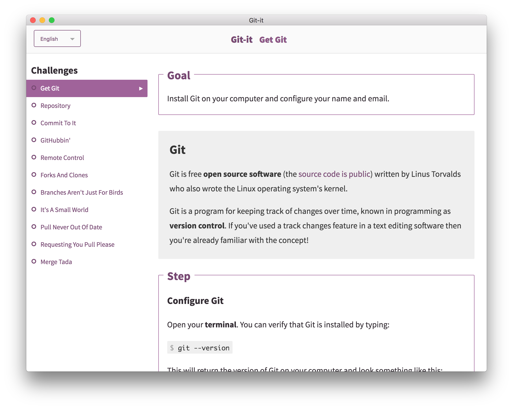

# Git-it (Desktop App) - adapted for Command Shift

Git-it is a desktop (Mac, Windows and Linux) app that teaches you how to use Git and GitHub on the [command line](https://en.wikipedia.org/wiki/Command-line_interface). Please work through all of the steps, ensuring you verify your solutions along the way.

---

## Hello future Forkers, Branchers and Pull Requesters!

This application contains challenges for learning Git and GitHub—by using _real_ Git and GitHub, not emulators. You'll be learning the awesome (and not so scary) command line and GitHub which means when you finish all of the challenges you'll have _real_ repositories on your GitHub account and green squares on your [contribution chart](https://github.com/blog/1360-introducing-contributions).

## Applications

You will need to use and install this app Git-it, as well as Visual Studio Code to edit the files. You'll also of course need Git (you should have Visual Studio Code and Git installed already).

### Git-it

You can view the [releases](https://github.com/MCRcodes/git-it-electron/releases) section of this repository to find the download for your operating system. Click to download your version. Once it has downloaded to your default Downloads directory, unzip the folder and run the Git-it executable. The executables for Mac, Windows and Linux:

- **Mac** Right (control) click the Git-it icon, select Open and then Open again. You can drag the icon into your Applications directory if you want, but it's not required. If needed, more [detailed installation instructions](https://github.com/jlord/git-it-electron/issues/121#issue-149747488) can be found in this issue.
- **Windows** Double-click the executable.
- **Linux** Double-click the executable. If the app isn't running, [see this issue](https://github.com/jlord/git-it-electron/issues/182).

## Get Started!

Open Git-it and click the button to begin the first challenge. Have your terminal and Visual Studio Code open too. Follow along with the instructions in each challenge and use the terminal or editor as instructed.

When you've completed the steps in a challenge click 'Verify'. Depending on the challenge you may need to also select the folder you did your work in for Git-it to verify.

**Questions?** Post them in your cohort slack channel!

---

### Tips For Getting Started

**Code snippets** often times look like `$ some code-stuff --here`. The dollar sign identifies the line as one a user would enter into the command line, but you don't actually include it when you type it into terminal. In this case, you'd actually just type `some code-stuff --here`.

**Variables** are indicated by `<VARIABLENAME>` in code snippets. When you actually use the line of code, replace `<VARIABLENAME>`, with your variable. For instance to make a new folder in terminal the format is, `mkdir <FOLDERNAME>`, so if you wanted to make a folder named 'octocat', you'd type: `mkdir octocat`.

**Command line, terminal and bash** all basically mean the same thing: the MS-DOS, Doogie Howser looking screen full of words and numbers. It's awesomely powerful and allows you to control your computer with text commands.

You can do a lot of things from your terminal like delete, rename, copy or create files and folders; run scripts and send things back and forth between servers (like the ones storing things on GitHub.com) and your computer (also a server!).
